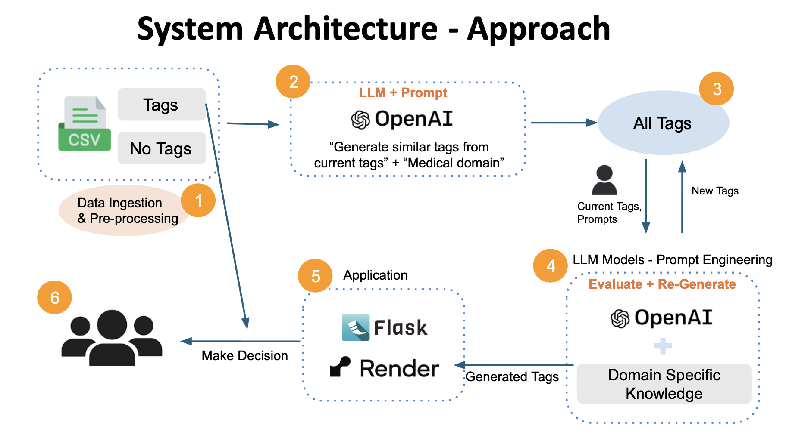

# Auto-tagging System - Tyler Technology

Auto tagging system that generates tags for dataset based on name and description of dataset.

## Introduction
This project was part of Artificial Intelligence Industry Practicum, where we corporated with Tyler Technology. The Tyler Technology is a 
company that provides software & services for the governing agencies and public sectors. The project was to provide tagging system to U.S. 
Government Department of Health & Human service, specifically for website: HealthData.gov. The website stores various health data with metadata 
including tags. However, current tags are being generated with human power and some data even do not have tags. In order to reduce human power and
ensure to have tags for all dataset, our team developed a auto-tagging system that automatically generates tags based on looking at name and description of data. 



## Codebase Structure
- `data` - meta data files that are used to generate tags based on description
- `images` - image that describes the project architecture
- `static` - css file for building web app
- `templates` - html templates for building web app
- `.env` - OpenAI API key
- `app.py` - python script for building web app
- `main.py` - main python script for generating tags
- `requirements.txt` - A file listing the project's dependencies

## Installation

To install the necessary dependencies, run the following command:

```bash
pip install -r requirements.txt
```

## Usage
1. Generate tags with openAI
```bash
python3 main.py -method 'openai'
```
2. Generate tags with Yake
```bash
python3 main.py -method 'yake'
```
3. Generate tags with TF-IDF
```bash
python3 main.py -method 'tfidf'
```
4. Generate tags with customized data (data should have 'Name', 'Description', 'Tags' columns)
```bash
python3 main.py -data 'name of csv file'
```


## Members:
- Jiyul Kim
- Jeongyoon Lee
- Shreya Singh